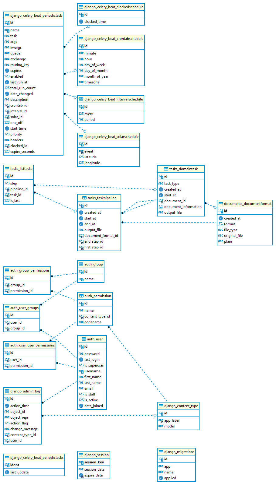
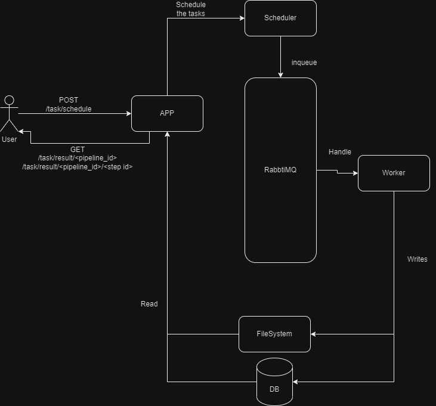

# Technical test geacco


## installation

This Application is fully dockerized so just need to have a docker and run, to install docker check [this doc](https://www.docker.com/)
```sh
docker-compose up
```

and it should works

### first time running
When you run for the first time you will need to make migrations
to do that make this steps
```sh
docker-compose up
docker-compose run app python manage.py migrate
```
and that should be enough

### Running without docker
you will need these dependencies
- [rabbitMq](https://www.rabbitmq.com/)
- [mysql](https://www.mysql.com/)
- [python](https://www.python.org/)

then run following commands
```sh
python3 -m venv env
source env/bin/activate
pip install -r requirements.txt
cd src
python manage.py migrate
python manage.py runserver
```
in another terminal start the scheduler
```sh
cd src
celery -A src beat -l debug --scheduler django_celery_beat.schedulers:DatabaseScheduler
```

in another terminal start the worker
```sh
cd src
celery -A src worker --loglevel=debug
```
## Domain concepts

- User: Anyone that hits the API , there is no restriction of any kind
- Document format: A file upload from an user that has a structure, it will be use as a template to fill the fields specified in them with {{}}
- Task: An specific process to do over a document format
- pipeline: An ordered list of task to do over a document format
## API
| Method | Endpoint                                 | Type of requests | use                                                                                    | Payload                                                                                                                                                                                                                                                                                                                                                                                                                                                                                                                                                  |
|--------|------------------------------------------|------------------|----------------------------------------------------------------------------------------|----------------------------------------------------------------------------------------------------------------------------------------------------------------------------------------------------------------------------------------------------------------------------------------------------------------------------------------------------------------------------------------------------------------------------------------------------------------------------------------------------------------------------------------------------------|
| POST   | /documents/create/                       | FormData/JSON    | This method is used to upload the templates to the server                              | - FormData <br/>      form: " file_to_upload "<br/> - JSON:<br/> ```json {"form":"text with the template"} ```                                                                                                                                                                                                                                                                                                                                                                                                                                           |
| POST   | /task/schedule/                          | JSON             | This method is used to schedule tasks for a format data                                | ```json { 'document_format': "id of dcoument format to use", 'steps': [   'start': {      'days':"how many days in future run this tasks (optional)",      'seconds':"how many seconds in future run this tasks (optional)",      'minutes':"how many minutes in future run this tasks (optional)",      'hours':"how many hours in future run this tasks (optional)",      'weeks': "how many weeks in future run this tasks (optional)"       },    'type':"FILL/'GENERATE'",    'payload':"A dict with keys to be replaced in the format",     ] }``` |
| GET    | /documents                               | N/A              | This method retrieves from the server all existen format documents and his information | N/A                                                                                                                                                                                                                                                                                                                                                                                                                                                                                                                                                      |
| GET    | /documents/<format id>                   | N/A              | This method retrieves from the server an specific format document and his information  | N/A                                                                                                                                                                                                                                                                                                                                                                                                                                                                                                                                                      |
| GET    | /documents/fill/<format id>              | JSON             | This method fill a specific format document, and return it fill it                     | The specific keys for your document                                                                                                                                                                                                                                                                                                                                                                                                                                                                                                                      |
| GET    | /task/result/<pipeline id>               | N/A              | This method returns the file from specific finished pipeline                           | N/A                                                                                                                                                                                                                                                                                                                                                                                                                                                                                                                                                      |
| GET    | /task/result/<pipeline id>/<step number> | N/A              | This method returns the file from specific step from a pipeline                        | N/A
For quick test of this code here [postman collection](doc/postman_collection.json) that you can import to postman, also here is a [tutorial](https://learning.postman.com/docs/collections/using-collections) about how to do it
### Database

### Queue and scheduling

### Use cases
- As a user can upload a document template in PDF,Excel,Word or plain text
- As a user can fill a previous document template with his respective payload
- As a user can retrieve all the document templates in the system or an specific one
- As a user can create a pipeline of task for a document template
- As a user can retrieve the result of all pipeline or the result from specific step

## Steps forward
- Add unit tests
- set-up github actions

## Known bugs
- when replace fields on the template it still {} an after the change
- not always keeps the format of the document , specially with colors and images
- the bool values are not set in black on Excel files
